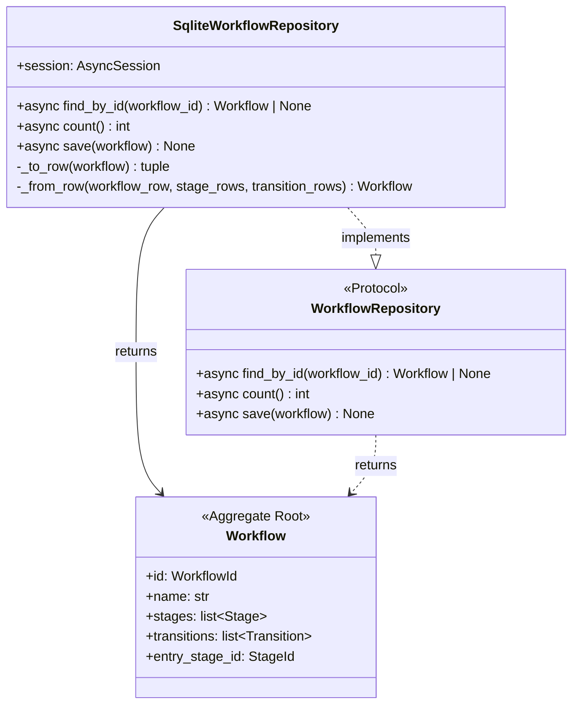
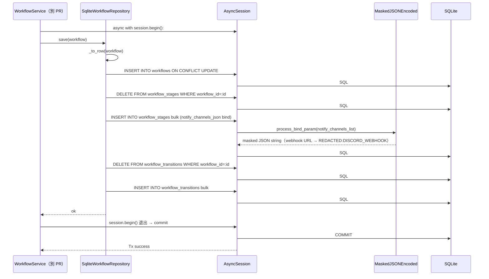
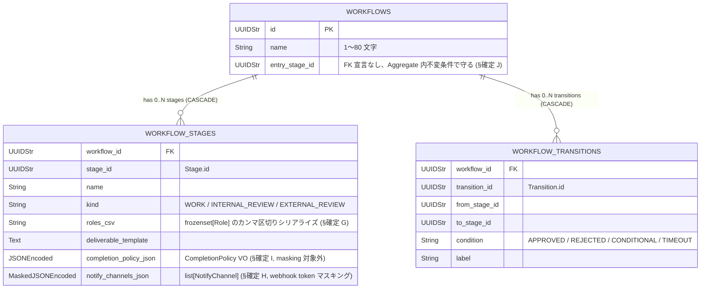

# 基本設計書

> feature: `workflow`（業務概念）/ sub-feature: `repository`
> 親業務仕様: [`../feature-spec.md`](../feature-spec.md)
> 関連: [`../../empire-repository/`](../../empire-repository/) **テンプレート真実源** / [`../domain/`](../domain/)（domain 設計済み）

## 記述ルール（必ず守ること）

基本設計に**疑似コード・サンプル実装（python/ts/sh/yaml 等の言語コードブロック）を書かない**。
ソースコードと二重管理になりメンテナンスコストしか生まない。
必要なのは構造契約（クラス・モジュール・データの関係）であり、実装の細部は [detailed-design.md](detailed-design.md) で凍結する。

## §モジュール契約（機能要件）

本 sub-feature が満たすべき機能要件を凍結する。親 [`../feature-spec.md`](../feature-spec.md) §ビジネスルール R1-11 / R1-12 および §受入基準 AC#11 / AC#12 をここで実装レベルに展開する。

### REQ-WFR-001: WorkflowRepository Protocol 定義

| 項目 | 内容 |
|-----|-----|
| 入力 | なし（Protocol 定義） |
| 処理 | `find_by_id(workflow_id: WorkflowId) → Workflow \| None` / `count() → int` / `save(workflow: Workflow) → None` の 3 メソッドを `async def` で宣言 |
| 出力 | Protocol クラス（`application/ports/workflow_repository.py`） |
| エラー時 | 定義エラーは import 時に静的検査（pyright strict）で検出 |

### REQ-WFR-002: SqliteWorkflowRepository 実装

| 項目 | 内容 |
|-----|-----|
| 入力 | `AsyncSession`（コンストラクタ）、Workflow ID または Workflow インスタンス（各メソッド） |
| 処理 | Protocol 3 メソッドを SQLite + SQLAlchemy 2.x AsyncSession で実装。`save()` は同一 Tx 内 delete-then-insert（§確定 B）、`find_by_id()` は 3 テーブル SELECT + `_from_row` で Aggregate 再構築、`count()` は SQL `COUNT(*)` |
| 出力 | `Workflow \| None`（find_by_id）/ `int`（count）/ None（save） |
| エラー時 | `sqlalchemy.IntegrityError` / `sqlalchemy.OperationalError` / `pydantic.ValidationError` を上位伝播（握り潰し禁止）|

### REQ-WFR-003: Alembic 0003 マイグレーション

| 項目 | 内容 |
|-----|-----|
| 入力 | Alembic upgrade head コマンド |
| 処理 | `0003_workflow_aggregate.py` revision で `workflows` / `workflow_stages` / `workflow_transitions` の 3 テーブル + UNIQUE 制約 + INDEX を追加。`down_revision="0002_empire_aggregate"` で chain 一直線 |
| 出力 | 3 テーブル追加済みの SQLite DB |
| エラー時 | `downgrade` は逆順で 3 テーブル削除（cascade で子から先に削除） |

### REQ-WFR-004: CI 三層防衛拡張（partial-mask テンプレート）

| 項目 | 内容 |
|-----|-----|
| 入力 | `scripts/ci/check_masking_columns.sh`（Layer 1）/ `backend/tests/architecture/test_masking_columns.py`（Layer 2） |
| 処理 | Layer 1: `workflow_stages.notify_channels_json` に `MaskedJSONEncoded` 必須（正のチェック）+ 他カラムに Masked* 不在（負のチェック）。Layer 2: arch test parametrize に Workflow 3 テーブル追加（partial-mask テンプレート確立） |
| 出力 | CI pass / fail |
| エラー時 | マスキング対象カラムに `MaskedJSONEncoded` 未宣言 → grep guard exit 非 0 で PR ブロック |

### REQ-WFR-005: storage.md 逆引き表更新

| 項目 | 内容 |
|-----|-----|
| 入力 | `docs/design/domain-model/storage.md` |
| 処理 | §逆引き表に Workflow 関連 3 行追加（`workflow_stages.notify_channels_json` = partial-mask 1 行 + `workflows` / `workflow_transitions` = no-mask 2 行） |
| 出力 | 更新済み `storage.md` |
| エラー時 | Layer 3 doc テストで Workflow 行の存在を assert（TC-DOC-WFR-001） |

## モジュール構成

| 機能 ID | モジュール | ディレクトリ | 責務 |
|--------|----------|------------|------|
| REQ-WFR-001 | `WorkflowRepository` Protocol | `backend/src/bakufu/application/ports/workflow_repository.py` | Repository ポート定義（empire-repo と同パターン、§確定 A） |
| REQ-WFR-002 | `SqliteWorkflowRepository` | `backend/src/bakufu/infrastructure/persistence/sqlite/repositories/workflow_repository.py` | SQLite 実装、§確定 B + §確定 G〜J |
| REQ-WFR-003 | Alembic 0003 revision | `backend/alembic/versions/0003_workflow_aggregate.py` | 3 テーブル + UNIQUE 制約 + INDEX 追加、`down_revision="0002_empire_aggregate"` |
| REQ-WFR-004 | CI 三層防衛拡張（Layer 1） | `scripts/ci/check_masking_columns.sh`（既存ファイル更新） | Workflow 3 テーブル明示登録、`notify_channels_json` の `MaskedJSONEncoded` 必須を assert |
| REQ-WFR-004 | CI 三層防衛拡張（Layer 2） | `backend/tests/architecture/test_masking_columns.py`（既存ファイル更新） | parametrize に Workflow 3 テーブル追加 |
| REQ-WFR-005 | storage.md 逆引き表更新 | `docs/design/domain-model/storage.md`（既存ファイル更新） | Workflow 関連 3 行追加 |
| 共通 | tables/workflows.py / workflow_stages.py / workflow_transitions.py | `backend/src/bakufu/infrastructure/persistence/sqlite/tables/` | 新規 3 ファイル |

```
ディレクトリ構造（本 feature で追加・変更されるファイル）:

.
├── backend/
│   ├── alembic/
│   │   └── versions/
│   │       └── 0003_workflow_aggregate.py             # 新規: 3 テーブル + INDEX 追加
│   ├── src/
│   │   └── bakufu/
│   │       ├── application/
│   │       │   └── ports/
│   │       │       └── workflow_repository.py         # 新規: Protocol
│   │       └── infrastructure/
│   │           └── persistence/
│   │               └── sqlite/
│   │                   ├── repositories/
│   │                   │   └── workflow_repository.py # 新規: SqliteWorkflowRepository
│   │                   └── tables/
│   │                       ├── workflows.py           # 新規
│   │                       ├── workflow_stages.py     # 新規（notify_channels_json は MaskedJSONEncoded）
│   │                       └── workflow_transitions.py # 新規
│   └── tests/
│       ├── infrastructure/
│       │   └── persistence/
│       │       └── sqlite/
│       │           └── repositories/
│       │               └── test_workflow_repository/  # 新規ディレクトリ（500 行ルール、empire-repo PR #29 教訓）
│       │                   ├── __init__.py
│       │                   ├── test_protocol_crud.py
│       │                   ├── test_save_semantics.py
│       │                   ├── test_constraints_arch.py
│       │                   └── test_masking.py
│       └── architecture/
│           └── test_masking_columns.py                # 既存更新: Workflow 3 テーブル parametrize 追加
├── scripts/
│   └── ci/
│       └── check_masking_columns.sh                   # 既存更新: Workflow 3 テーブル明示登録
└── docs/
    ├── design/
    │   └── domain-model/
    │       └── storage.md                             # 既存更新: 逆引き表に Workflow 3 行追加
    └── features/
        └── workflow/                                  # 本 feature 設計書（階層化済み）
            └── repository/                            # 本 sub-feature 設計書 3 本
```

## クラス設計（概要）



**凝集のポイント**（empire-repo と同パターン）:

- `WorkflowRepository` Protocol は application 層、domain は知らない
- `SqliteWorkflowRepository` は infrastructure 層、Protocol を型レベルで満たす
- domain ↔ row 変換は `_to_row()` / `_from_row()` の private method
- `save()` は同一 Tx 内で 3 テーブル delete-then-insert（§確定 B）
- 呼び出し側 service が `async with session.begin():` で UoW 境界を管理（Repository は session を受け取るのみ）

## 処理フロー

### ユースケース 1: Workflow の新規作成（save 経路）

1. application 層 `WorkflowService.create(name, stages, transitions, entry_stage_id)` が以下を実行（本 PR スコープ外、別 PR）
   - `Workflow(id=uuid4(), name=name, stages=stages, transitions=transitions, entry_stage_id=entry_stage_id)` を構築（pre-validate）
2. service が `async with session.begin():` で UoW 境界を開く
3. service が `WorkflowRepository.save(workflow)` を呼ぶ
4. `SqliteWorkflowRepository.save(workflow)` が以下を順次実行（同一 Tx 内、§確定 B 5 段階）:
   - `_to_row(workflow)` で `workflows_row` / `stage_rows` / `transition_rows` に分離（§確定 G/H/I で各カラム凍結）
   - workflows UPSERT
   - workflow_stages DELETE → bulk INSERT（`roles_csv` シリアライズ + `notify_channels_json` の `MaskedJSONEncoded` 経路）
   - workflow_transitions DELETE → bulk INSERT
5. `session.begin()` ブロック退出で commit

### ユースケース 2: Workflow の取得（find_by_id 経路）

1. application 層が `WorkflowRepository.find_by_id(workflow_id)` を呼ぶ
2. `SqliteWorkflowRepository.find_by_id(workflow_id)` が以下を実行:
   - `SELECT * FROM workflows WHERE id = :workflow_id`（不在なら None）
   - `SELECT * FROM workflow_stages WHERE workflow_id = :workflow_id ORDER BY stage_id`（§Known Issues §BUG-EMR-001 規約）
   - `SELECT * FROM workflow_transitions WHERE workflow_id = :workflow_id ORDER BY transition_id`
   - `_from_row(workflow_row, stage_rows, transition_rows)` で Workflow 復元（`roles_csv` を frozenset[Role] に / `notify_channels_json` を list[NotifyChannel] に / `completion_policy_json` を CompletionPolicy に復元）
3. valid な Workflow を返却

### ユースケース 3: Workflow の更新（save 経路）

1. application 層が `find_by_id(workflow_id)` で既存 Workflow を取得
2. service が Workflow のドメイン操作（例: `workflow.add_stage(stage_data)`）で新 Workflow を構築（pre-validate 方式）
3. service が `WorkflowRepository.save(updated_workflow)` を呼ぶ
4. ユースケース 1 と同じ手順で同一 Tx 内に delete-then-insert（差分計算なし、子テーブル全件削除→全件再挿入）

### ユースケース 4: Workflow 件数取得（count 経路）

1. application 層 `WorkflowService` が `WorkflowRepository.count()` を呼ぶ
2. `SqliteWorkflowRepository.count()` が `select(func.count()).select_from(WorkflowRow)` で SQL レベル `COUNT(*)` 発行（§確定 D 補強、empire-repo PR #29 で凍結）
3. `scalar_one()` で `int` 取得

## シーケンス図



## アーキテクチャへの影響

- `docs/design/domain-model.md` への変更: なし（モジュール配置案は概念定義済み、本 PR で実体化）
- `docs/design/domain-model/storage.md` への変更: **§逆引き表に Workflow 関連 3 行追加**（§確定 E、本 PR で同一コミット）
- `docs/design/tech-stack.md` への変更: なし
- 既存 feature への波及:
  - `feature/persistence-foundation`（PR #23）の上に乗る
  - `feature/empire-repository`（PR #29 / #30）テンプレート踏襲
  - `workflow/domain/`（PR #16）の domain 層 Workflow を import するのみ、domain 設計書は変更しない

## 外部連携

該当なし — 理由: infrastructure 層に閉じる。

| 連携先 | 目的 | プロトコル | 認証 | タイムアウト / リトライ |
|-------|------|----------|-----|--------------------|
| 該当なし | — | — | — | — |

## UX 設計

該当なし — 理由: UI を持たない infrastructure 層。

| シナリオ | 期待される挙動 |
|---------|------------|
| 該当なし | — |

**アクセシビリティ方針**: 該当なし。

## セキュリティ設計

### 脅威モデル

詳細な信頼境界は [`../../../design/threat-model.md`](../../../design/threat-model.md)。本 feature 範囲では以下の 2 件。

| 想定攻撃者 | 攻撃経路 | 保護資産 | 対策 |
|-----------|---------|---------|------|
| **T1: `notify_channels_json` 経由の Discord webhook token 漏洩** | Workflow 設計時に CEO が NotifyChannel に webhook URL を貼り付け → Repository 経由で永続化 → DB 直読みで token 流出 | Discord webhook token | `notify_channels_json` を **`MaskedJSONEncoded`** で宣言、`process_bind_param` で `MaskingGateway.mask_in()` 経由マスキング（`<REDACTED:DISCORD_WEBHOOK>` 化）。Schneier 申し送り #6 の Workflow 経路適用。CI 三層防衛 Layer 1 grep guard + Layer 2 arch test で `MaskedJSONEncoded` 必須を物理保証 |
| **T2: 永続化 Tx の半端終了による参照整合性破損** | `save()` 中に SQLite クラッシュ → `workflow_stages` 行のみ INSERT されて `workflow_transitions` が DELETE のみで終了 | Workflow の整合性 | 同一 Tx 内の delete-then-insert（§確定 B）+ M2 永続化基盤の WAL crash safety + foreign_keys ON。Tx 全体が ATOMIC、半端終了で rollback |

### OWASP Top 10 対応

| # | カテゴリ | 対応状況 |
|---|---------|---------|
| A01 | Broken Access Control | 該当なし（infrastructure 層、認可は別 feature） |
| A02 | Cryptographic Failures | **適用**: `notify_channels_json` の Discord webhook token を `MaskedJSONEncoded` で永続化前マスキング |
| A03 | Injection | **適用**: SQLAlchemy ORM 経由で SQL injection 防御。raw SQL は使わない |
| A04 | Insecure Design | **適用**: Repository ポート分離（依存方向 domain ← application ← infrastructure） + delete-then-insert 戦略で Tx 原子性 |
| A05 | Security Misconfiguration | M2 永続化基盤の PRAGMA 強制の上に乗る |
| A06 | Vulnerable Components | SQLAlchemy 2.x / Alembic / aiosqlite |
| A07 | Auth Failures | 該当なし |
| A08 | Data Integrity Failures | **適用**: foreign_keys ON + ON DELETE CASCADE で参照整合性、Tx 原子性 |
| A09 | Logging Failures | **適用**: `notify_channels_json` のマスキングにより SQL ログ / 監査ログ経路で Discord webhook token 漏洩なし。M2 永続化基盤のマスキング適用ログ基盤の上に乗る |
| A10 | SSRF | 該当なし（外部 URL fetch なし、NotifyChannel の URL は受信側で TLS / origin 検証する別 feature 責務） |

## ER 図



UNIQUE 制約:

- `workflow_stages(workflow_id, stage_id)`: 同一 Workflow 内で stage_id 重複禁止
- `workflow_transitions(workflow_id, transition_id)`: 同一 Workflow 内で transition_id 重複禁止

masking 対象カラム: `workflow_stages.notify_channels_json` のみ（`MaskedJSONEncoded`、§確定 H）。CI 三層防衛で物理保証。

## エラーハンドリング方針

| 例外種別 | 処理方針 | ユーザーへの通知 |
|---------|---------|----------------|
| `sqlalchemy.IntegrityError`（FK 違反、UNIQUE 違反、stage_id / transition_id 重複） | application 層に伝播、HTTP API 層で 409 Conflict | application 層 / HTTP API の MSG（別 feature） |
| `sqlalchemy.OperationalError`（接続切断、ロック timeout） | application 層に伝播、HTTP API 層で 503 | 同上 |
| `pydantic.ValidationError`（domain Workflow 構築時、`_from_row` 内で発生し得る） | Repository 内で catch せず application 層に伝播、データ破損として扱う | application 層 / HTTP API の MSG |
| その他 | 握り潰さない、application 層へ伝播 | 汎用エラーメッセージ |

**Repository 内で明示的な commit / rollback はしない**: 呼び出し側 service が `async with session.begin():` で UoW 境界を管理（empire-repo §確定 B 踏襲）。
