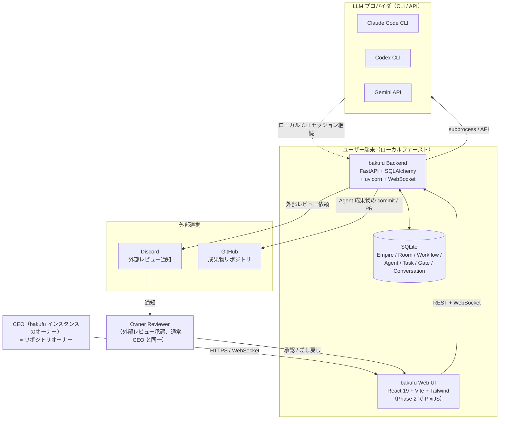

# システムコンテキスト

bakufu のシステムコンテキスト図とアクター一覧を凍結する。要件定義工程の起点であり、各 feature の業務仕様（[`../features/<name>/feature-spec.md`](../features/)）が本書を引用してシステム境界を共有する。

## システムコンテキスト図

## アクター

| アクター | 役割 | 期待 |
|---------|-----|------|
| CEO | bakufu インスタンスのオーナー、Empire / Room / Agent / Workflow を編成 | UI から数クリックで部屋を作成・採用、`$` directive で AI 群に指示できる |
| Owner Reviewer | 外部レビューゲートで承認/差し戻しを行う人間（通常 CEO 兼任） | Discord 通知から UI へ遷移し、deliverable を確認して 1 クリックで判断 |
| AI Agent | 採用された LLM エージェント（Claude Code / Codex / Gemini） | Room の Workflow に従い、Stage の deliverable を生成 |
| 外部 LLM プロバイダ | Anthropic / OpenAI / Google 等 | bakufu Backend が CLI / API 経由で会話継続つきで呼び出す |
| 外部メッセンジャー | Discord（MVP）、Slack ほか（Phase 2） | 外部レビュー依頼の通知配送 |
| GitHub | bakufu 自身のリポジトリ + 各 Empire が生成する成果物リポジトリ | コミット / PR / Issue の連携 |

## 関連

- [`use-cases.md`](use-cases.md) — 主要ユースケース（シーケンス図）
- [`functional-scope.md`](functional-scope.md) — 機能スコープ
- [`../analysis/personas.md`](../analysis/personas.md) — ペルソナ定義（業務観点）
- [`../design/architecture.md`](../design/architecture.md) — 技術観点での全体構造（粒度が異なる）
