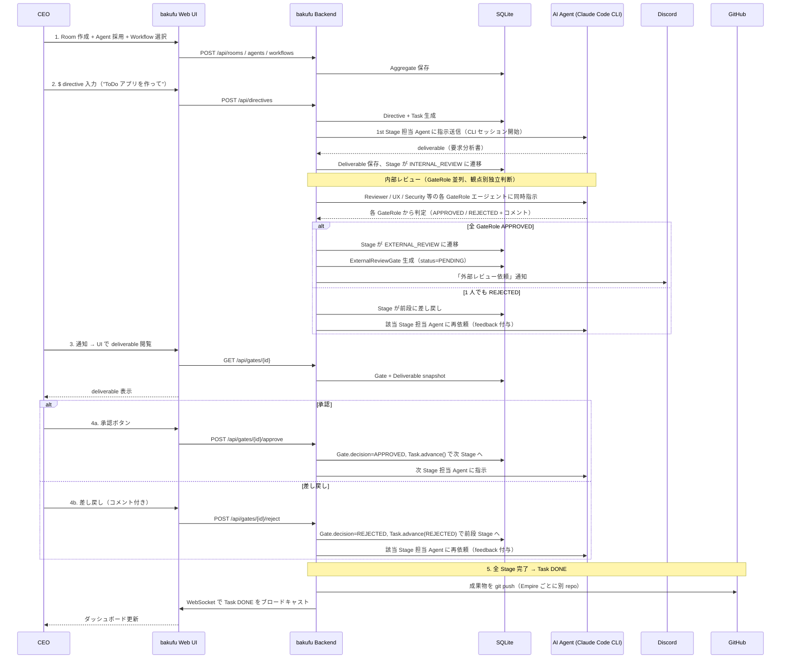

# 主要ユースケース

bakufu の代表的な業務シナリオをシーケンス図で凍結する。本ファイルは [`../acceptance-tests/scenarios/`](../acceptance-tests/) の根拠となる（PR2 で受入テスト戦略を新設）。

## ユースケース 1: V モデル開発室で directive から Task 完走

## 関連

- [`system-context.md`](system-context.md) — システムコンテキスト図 + アクター
- [`functional-scope.md`](functional-scope.md) — 機能スコープ
- [`acceptance-criteria.md`](acceptance-criteria.md) — 受入基準
- [`../acceptance-tests/scenarios/`](../acceptance-tests/) — 本ユースケースを E2E で検証する受入テスト（PR2 で新設）
